# Hexabot

The Hexabot is an educational robotics platform, aimed at teaching basic robotics concepts but going beyond a simple differential drive robots without added features. This documentation is intended to be used together with the online Hexabot educational module.

The Hexabot features:

 - Three-wheeled omnidirectional movement, with precise tracking using built-in encoders
 - 2DOF robot arm with gripper that can be extended to 3DOF using the rotational axis of the robot
 - Powerful Raspberry Pi Pico 2W controller, enabling wireless control over WiFi
 - Large 18650 LiPo battery for extended usage, including safety and charging circuit
 - OLED screen for easy-to-understand status messages and LEDs for quick visual indications
 - Multiple included sensors: battery fuel gauge, e-compass, laser distance sensing and ground or line detection
 - Huge extensibility with free digital and analog IO, multiple I2C ports including Qwiic and Stemma QT, two independant SPI ports and one UART port

    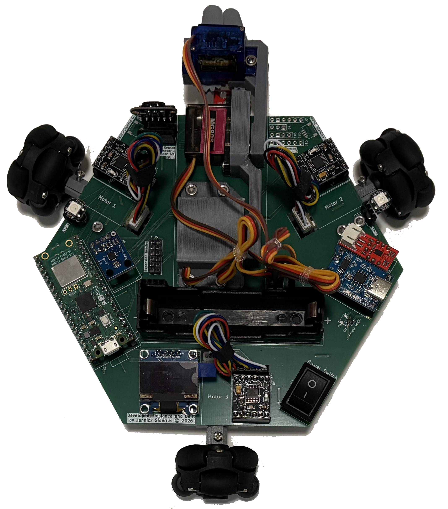

<!-- Colors: 🔴🟠🟡🟢🔵🟣🟤⚫⚪ -->

### Contents

- [Set-up the Hexabot](#set-up-the-hexabot)
  - [Installing the motors and robot arm](#installing-the-motors-and-robot-arm)
  - [Installing the electronic components](#installing-the-electronic-components)
  - [Installing the battery](#installing-the-battery)
  - [Installing the programming interface](#installing-the-programming-interface)
  - [Connecting the Hexabot to WiFi](#connecting-the-hexabot-to-wifi)
- [Programming the Hexabot](#programming-the-hexabot)
  - [Example programs](#example-programs)
  - [Blocks explained](#blocks-explained)
- [Frequent problems](#frequent-problems)
- [Component documentation](#component-documentation)
- [License](#license-and-contact)

<!-- - [Hardware](#hardware)
  - [Sensors](#sensors)
  - [Processor](#processor)
  - [Input/Output](#inputoutput)
  - [Expansion headers](#expansion-headers)
- [Software](#software)
  - [Arduino](#arduino-ide)
  - [IDE configuration](#ide-configuration)
  - [Serial Port Setup](#serial-port-setup)
  - [Libraries](#arduino-libraries)
  - [TensorFlow Lite Micro library](#tensorflow-lite-micro-library)
  - [Uploading code](#uploading-code)
- [Code examples](#code-examples)
  - [Sensor examples](#sensor-examples)
  - [I/O examples](#io-examples)
  - [TensorFlow Lite Micro examples](#tensorflow-lite-micro-examples)
  - [Board tests](#board-tests)
- [Frequently Encountered Issues](#frequently-encountered-issues) -->

## Set-up the Hexabot

The Hexabot will arive partially assembled, to be finished by the learner. Each Hexabot kit should contain the following parts and modules:

- 1x Hexabot circuit board
- 1x Raspberry Pi Pico 2W (pre-programmed with controller firmware)
- 1x LiPo 18650 cylindrical battery
- 1x Distance sensor (VL53L1X)
- 1x OLED screen (SSD1306)
- 1x Electronic compass (QMC5883L)
- 1x Ground sensor (QRE1113)
- 1x Battery charging circuit (TP4056)
- 1x Battery fuel gauge (MAX17043)
- 2x Adressable LED (WS2812B)
- 3x Motor controllers (DRV8833)
- 3x Motors with encoders (N20-Enc)
- 3x Motor holder (3D-printed)
- 3x Omnidirectional wheels
- 1x Pre-assembled robot arm (contains 2x servo motor MG90S, 1x servo motor SG90 and 3D-printed parts)
- 1x Mounting hardware (nuts and bolts, elastic bands for cables)
- 1x Alan key for mounting hardware
- 1x Spare parts bag
- (Optional) 1x USB-C cable for charging

    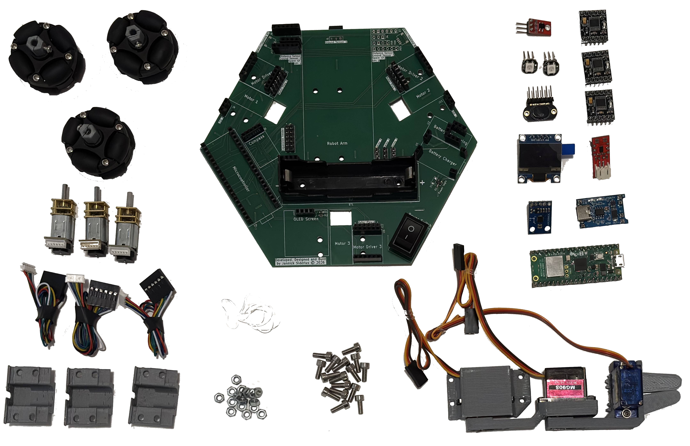

### Installing the motors and robot arm

To start the installation of the motors onto the Hexabot, prepare the following parts:

- Hexabot circuit board
- Motors with encoders
- Motor holders
- Mounting hardware
- Alan key for mounting hardware
  

    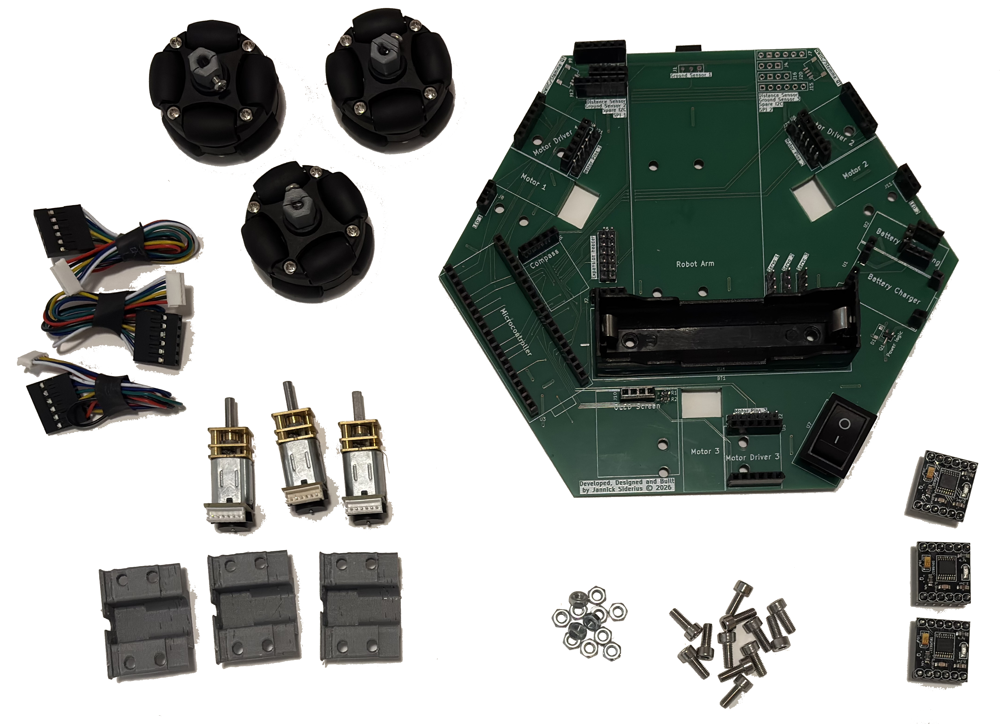

Press all motors into their motor holders, with each cable pointing towards the 'open' side of the motor holder. See the image below for a visual representation.

    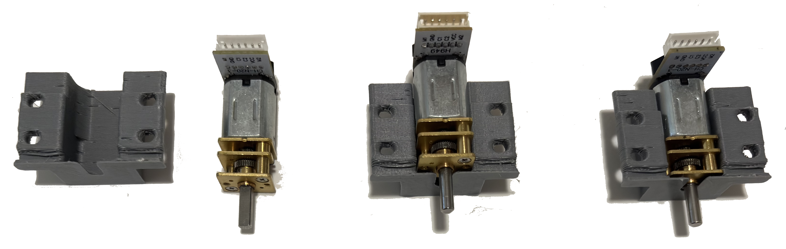

Take four nuts and bolts from the mounting hardware. Insert these from the top into the four holes that surround one motor on the Hexabot circuit board (e.g. marked "Motor 1"). Then insert the motor inside its holder onto the bolts from the unserside of the Hexabot circuit board. Finish mounting one motor by adding nuts to the bolts, clamping the motor holder (and motor) to the Hexabot circuit board in the process. The nuts and bolts can be tightened with the alan key to hand-tight pressure. See the image below for a visual guide.

Repeat the motor mounting process three times, until all motors are mounted.

    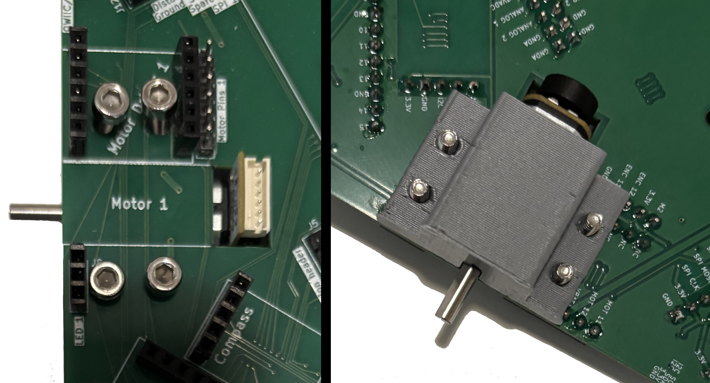

To attach the robot arm to the Hexabot, prepare the following parts:

- Hexabot circuit board
- Pre-assembled robot arm
- Mounting hardware
- Alan key for mounting hardware

    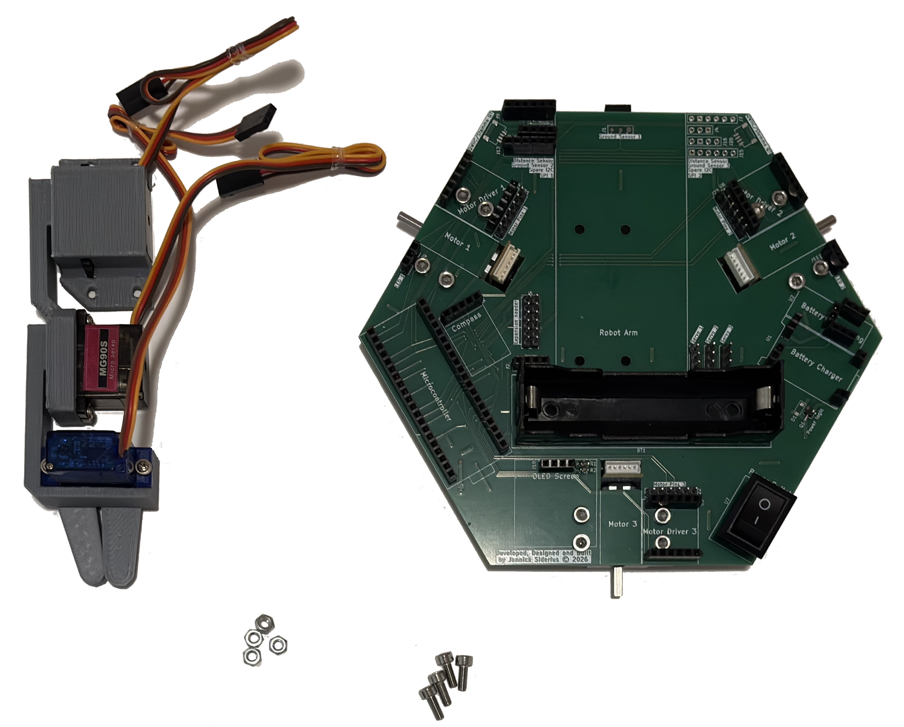

Take four nuts and bolts from the mounting hardware. Insert these from the top into the four holes of the robot base. Insert the robot arm assembly, including the bolts from the top into the four holes that surround the "Robot Arm" marking on the Hexabot circuit board. Finish mounting the robot arm assembly by adding nuts to the bolts on the underside of the Hexabot circuit board, clamping the robot arm in the process. The nuts and bolts can be tightened with the alan key to hand-tight pressure. See the image below for a visual guide.

    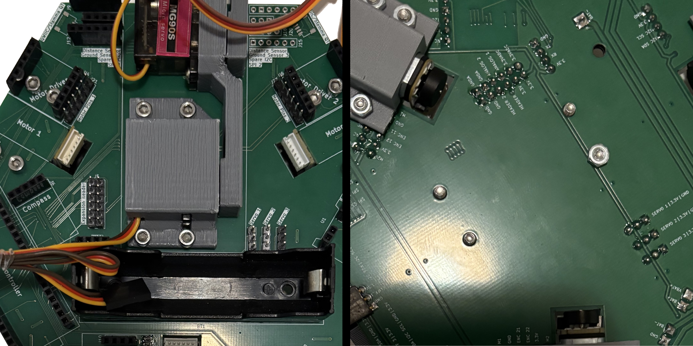

To finish the installation of both the motors and the robot arm assembly, their respective cables need to be connected. All three motors have a connector on the motor, and a pin header on the Hexabot circuit board, marked "Motor Pins n" (with n being the respective number) next to them. The black six-cable connector at the end of the motor cable can be plugged in the "Motor Pin n" connector. The white six-cable connector at the other end of the motor cable can be plugged into the motor with the flat side towards the inside. To fully insert the connected into the motor,  Looking from the inside of the robot towards the motor, the red cable (🔴) should be on the right side of the connector. See the image below for a visual guide. 

> [!NOTE]
> The connection from each motor to each motor controller is the same, however due to the layout of the Hexabot circuit board, it may seem like the color order of the cable is strange or wrong.

<!-- TODO: Change photo and text since this one is misleading -->

    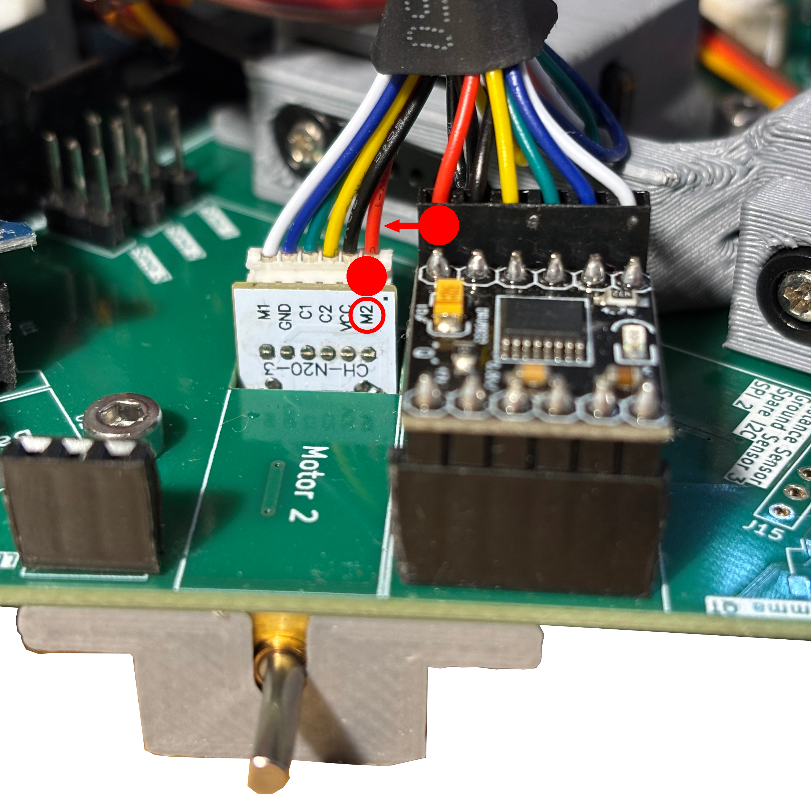

To finish the installation of the robot arm assembly, the cables from all servo motors need to be connected. There are three pin headers on the Hexabot circuit board labeled "Servo n" (with n being the respective number), they are located next to the robot arm base. The servomotor at the base of the robot arm should be plugged into "Servo 1", the middle servomotor should be plugged into "Servo 2" and the gripper servomotor should be plugged into "Servo 3". With the Hexabot circuit board oriented with the robot arm at the top, the brown cable (🟤) should be on the bottom / towards the battery holder. See the image below for a visual guide. 

    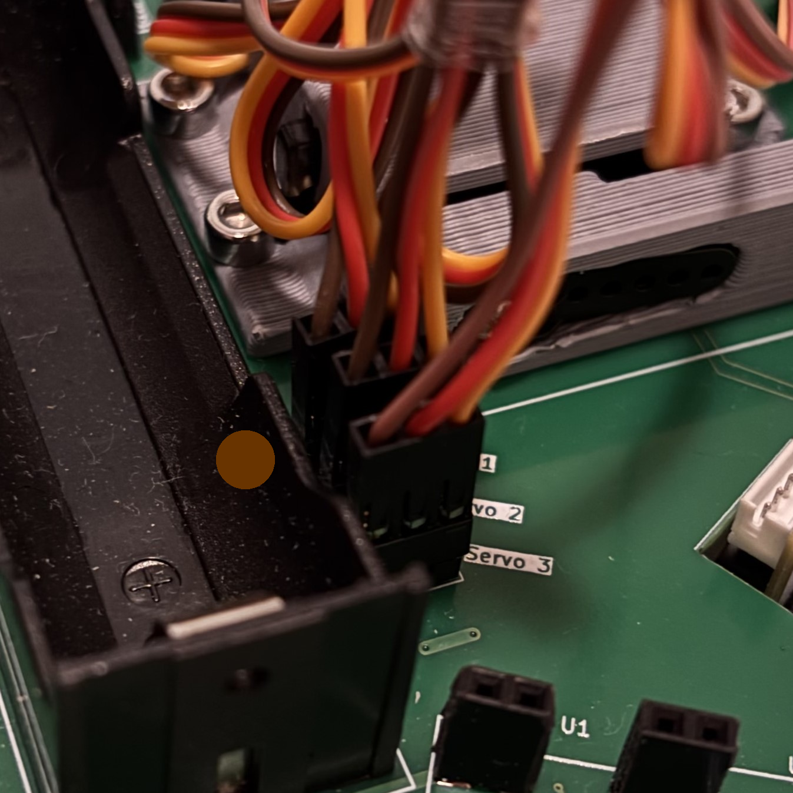

Lastly, install the three Omnidirectional wheels on each of the motor shafts. The wheels have a pre-assembled shaft collar which can slide over the motor shaft. The mounting screw on each shaft collar can be hand-tightened in order to fasten the wheel to the motor.

> [!NOTE]
> The motor shafts have a D-profile, meaning they are generally circular, but they have one flat side. The shaft collar on the omnidirectional wheels also has this shape and therefor can only fit onto the motor in one way.

    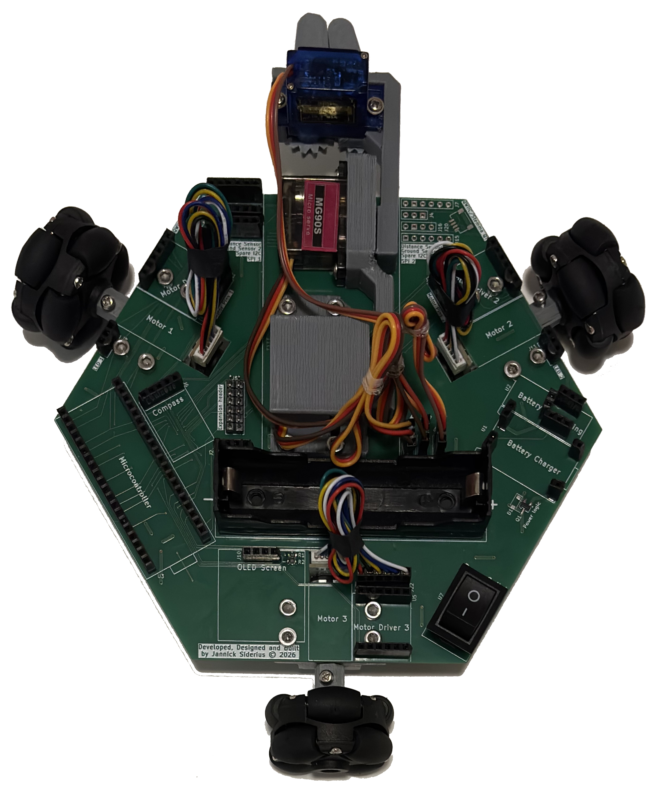

After all parts are mounted using hardware and all cables are attached, the motors and robot arm should be fully installed onto the Hexabot. Remaining cables can be folded and bundled with the elastic bands provided in the mounting hardware.

### Installing the electronic components

To start the installation of the electronic components onto the Hexabot, prepare the following parts:

- Hexabot circuit board
- Raspberry Pi Pico 2W
- Distance sensor
- OLED screen
- Electronic compass
- Ground sensor
- Battery charging circuit
- Battery fuel gauge
- Adressable LED
- Motor controllers
  

    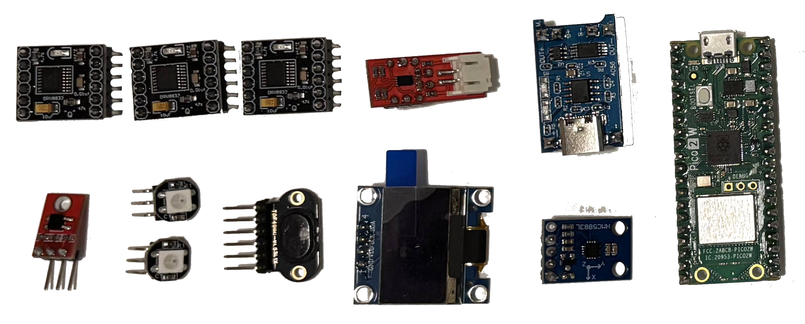

Insert all motor controllers into their connectors, labeled "Motor Driver n" (with n being the respective number) next to each motor. The motor drivers should be oriented so that the orange component is aligned with the red cable (🔴) of the motors. See the image below for a visual guide. 

Repeat the installation of the motor drivers three times, until all drivers are mounted.
  

    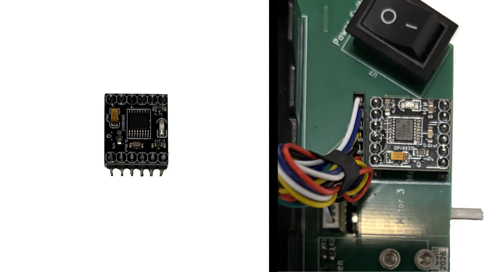

Insert both Adressable LEDs into their connectors labeled "LED n" (with n being the respective number). The LEDs are installed on the left and right side on the top side of the Hexabot circuit board. With the Hexabot circuit board oriented with the robot arm at the top, the LEDs should both point towards the right. See the image below for a visual guide. 

> [!NOTE]
> The connection from each LED to the Hexabot circuit board is the same, however due to the layout of the Hexabot circuit board, it may seem like one LED is turned around.
  

    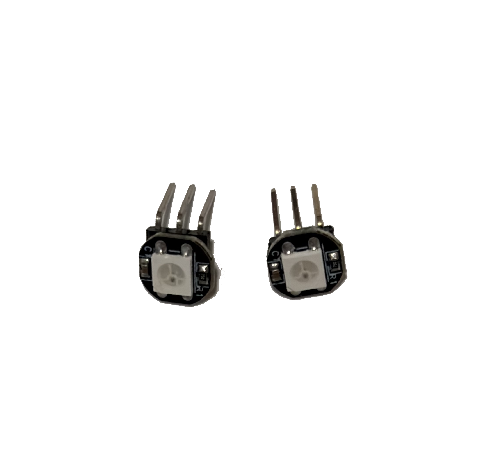

Insert the battery charging circuit into the connector(s) labeled "Battery Charger" on the right side of the Hexabot circuit board. The USB-C connector on the charging circuit should point to the outside of the robot in order to enable easy charging. Be careful to first align all pins of the charging circuit before pushing it into the connector, in order to prevent bending pins. See the image below for a visual guide. 
  

    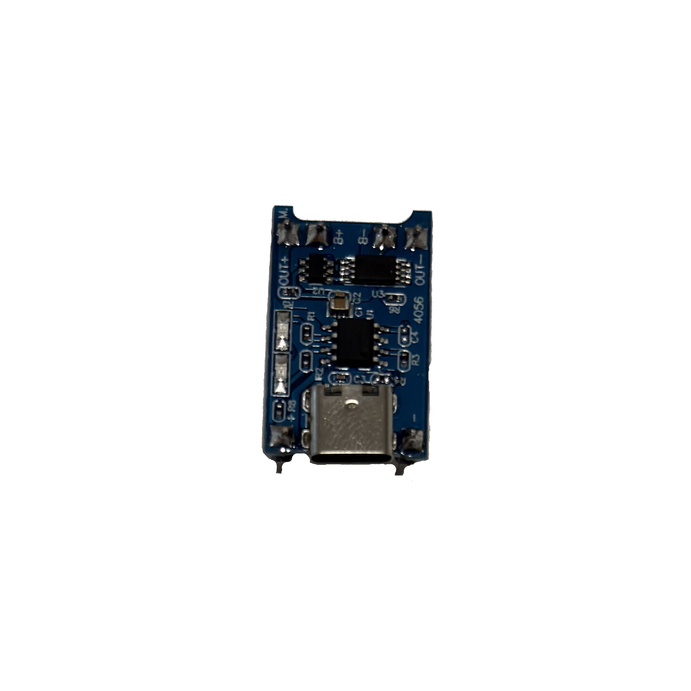

Insert the battery fuel gauge into the connector(s) labeled "Battery Monitoring" next to the battery charging circuit on the Hexabot circuit board. The white battery connector should point to the inside of the robot. Be careful to first align all pins of the charging circuit before pushing it into the connector, in order to prevent bending pins. See the image below for a visual guide. 

> [!NOTE]
> The battery connection on the battery fuel gauge is not used on the Hexabot, since the battery is internally connected to this module. No connection needs to be made to the white battery connector.
  

    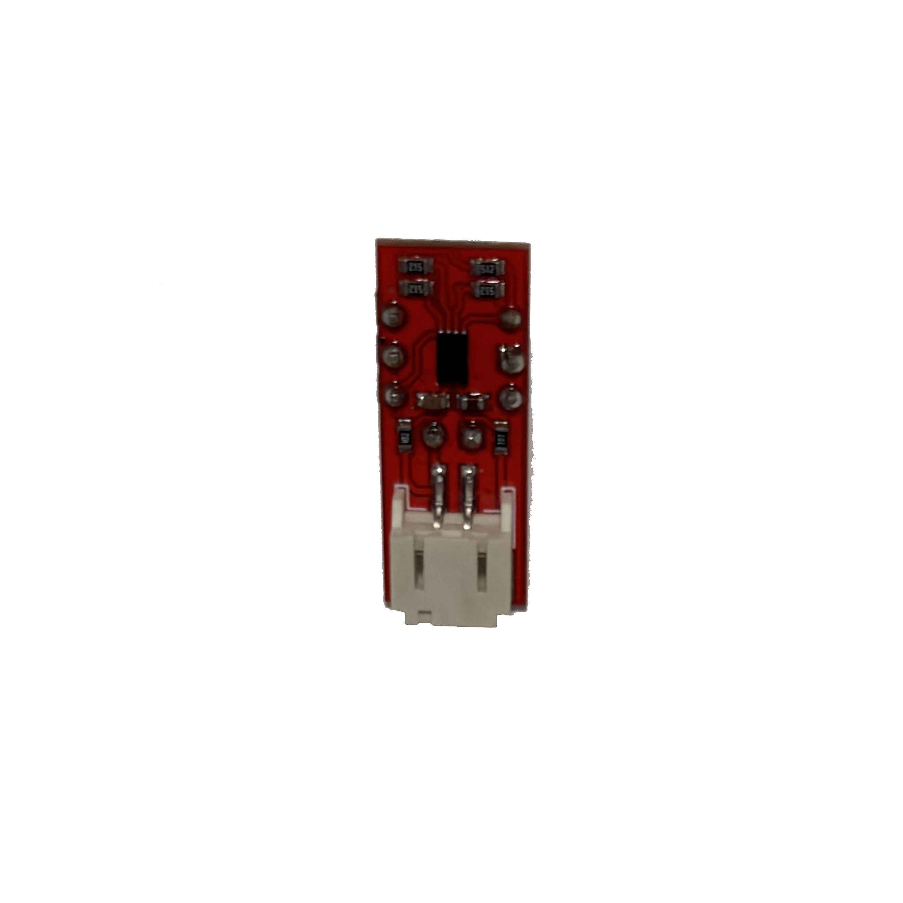

 

The LED, battery charging circuit and battery fuel gauge are installed as following in the Hexabot circuit board:

    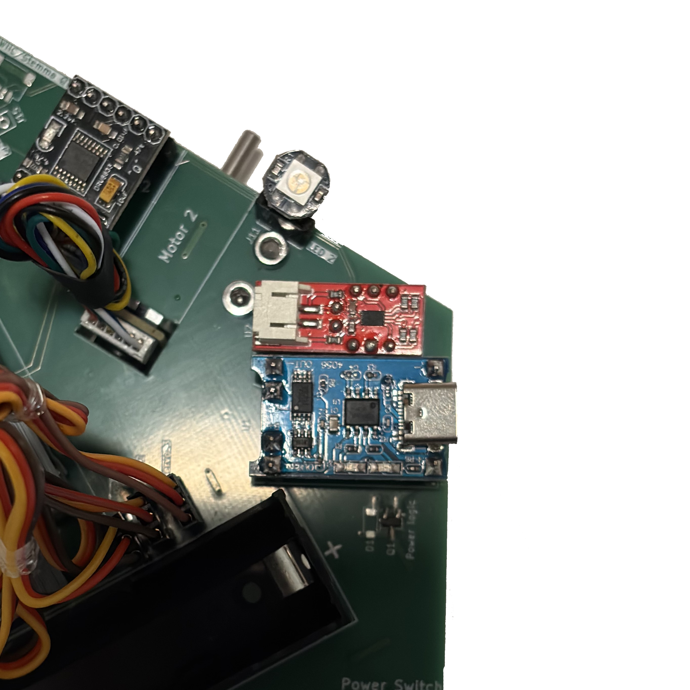

Insert the OLED screen into the connector labeled "OLED Screen" at the bottom of the Hexabot circuit board. The screen should point to the bottom of the robot, away from the battery holder. See the image below for a visual guide. 
  

    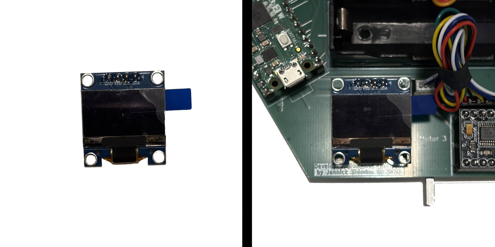

Insert the Distance sensor into the connector labeled "Distance Sensor" on the top left side of the Hexabot circuit board. The module should point with the black lens towards the front of the robot, pointing outwards. See the image below for a visual guide. 
  
> [!NOTE]
> The Hexabot circuit board features two mounting locations for the distance sensor, one on the top left and one on the top right of the robot. These connectors are identical and thus the distance sensor may be connected to either one. In this guide, the top left connector is used.

    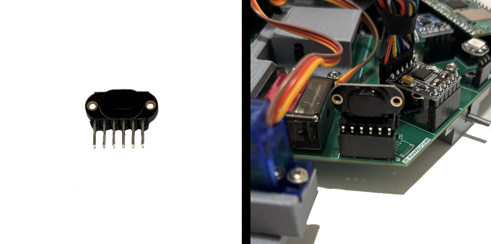

Insert the Ground sensor into the connector labeled "Ground Sensor 1" at the top of the Hexabot circuit board. The connector is on the underside, and the black element on the ground sensor should point downwards. See the image below for a visual guide. 
  
> [!NOTE]
> The Hexabot circuit board features three mounting locations for ground sensors, all along the top of the robot (left-to-right: Ground Sensor 2-1-3). The connectors are identical and enable the addition of extra ground sensors. In this guide, only the top middle connector is used.

    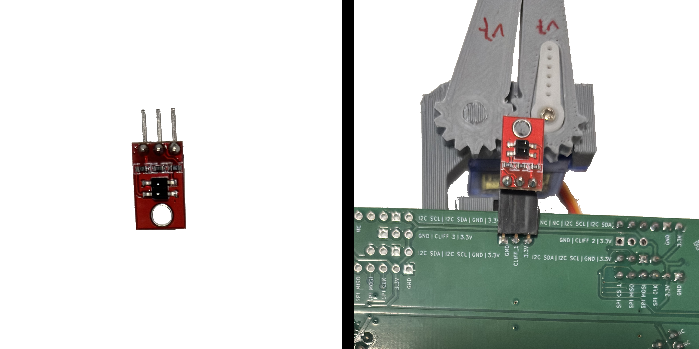

Insert the Electronic compass into the connector labeled "Compass" at the left side of the Hexabot circuit board. The module should point to the bottom of the robot, towards from the battery holder. See the image below for a visual guide. 
  

    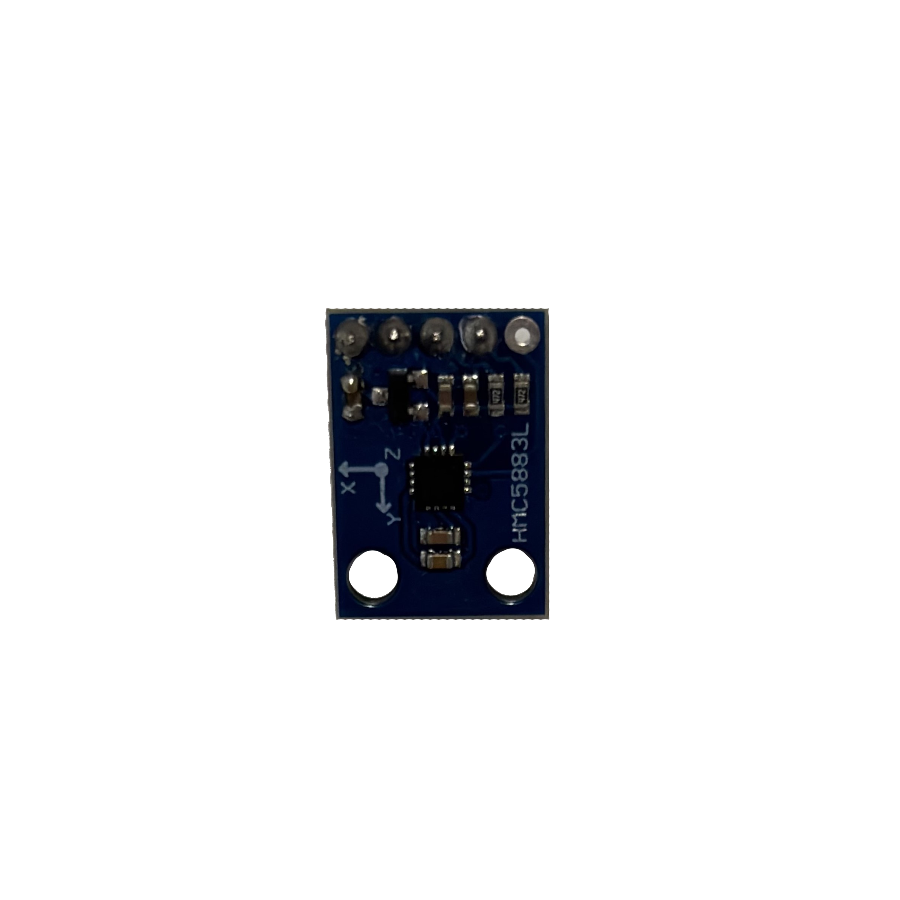

Lastly, the Raspberry Pi Pico 2W controller is inserted into the connector(s) labeled "Microcontroller" on the left side of the robot. The micro-USB connector of the controller should point to the bottom of the robot. Be careful to first align all pins of the controller before pushing it into the connector, in order to prevent bending pins. See the image below for a visual guide. 
  

    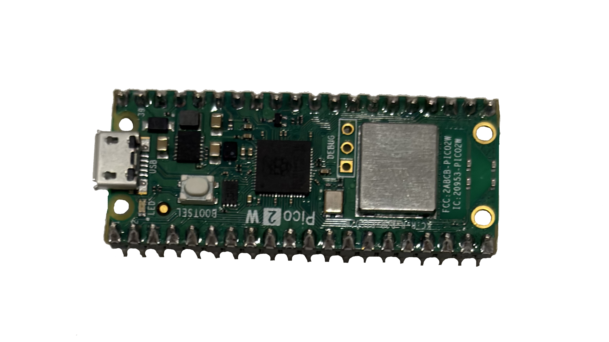

 

The Electronic compass and the controller are installed as following in the Hexabot circuit board:

    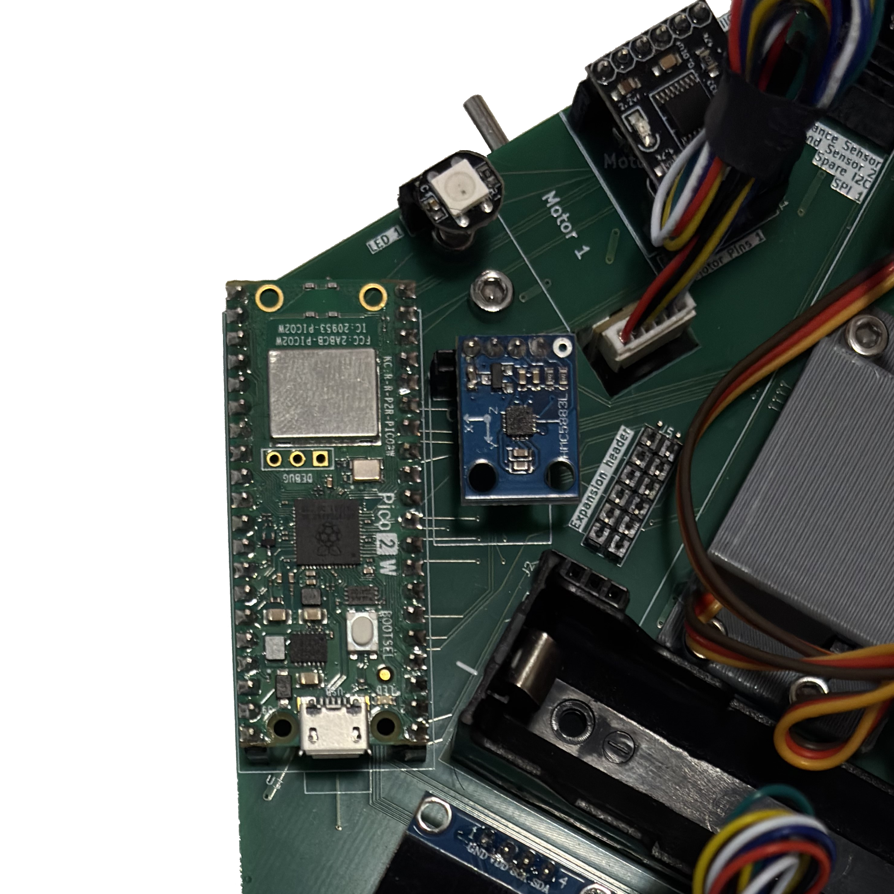

### Installing the battery

In order to provide power the Hexabot robot, the power source needs to be installed. The Hexabot is powered by a Lithium-Polymer (LiPo) 18650 form-factor cylindrical battery. This battery chemistry is the same that is used in many smartphones and laptop batteries. The battery should  be inserted into the Battery mount in the **correct orientation**. The Hexabot circuit board and the battery holder are both marked with Plus- and Minus-symbols. The battery has one flat top (Minus) and one smaller, slightly rounded top (Plus). Before starting the installation of the battery, ensure that the Power Switch is in the **O / Off position**. To insert the battery, first slide in the flat Minus side into the correct side of the holder, then push down on the slightly rounded Plus side until the battery is all the way inserted. See the image below for a visual guide. 
  

    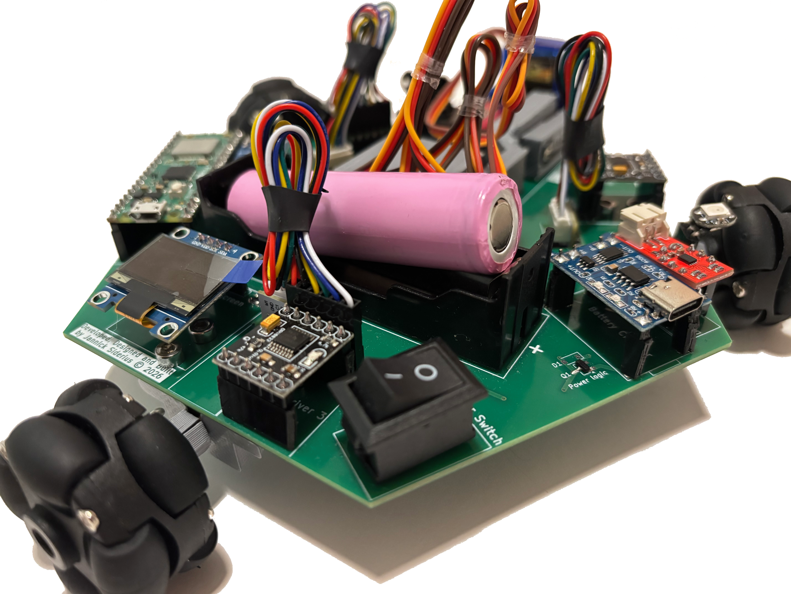

> [!WARNING]
> Lithium-Polymer batteries are very power-dense and can cause serious fires if treated improperly. Always keep them out of direct sunlight, away from heat sources and never pierce or directly short (connect plus to minus) the battery. If the battery is severely over-charged or discharged, this can lead to irrepairable damage. The battery charging circuit on the Hexabot has multiple chips that ensure that the battery safety is guaranteed.

<!-- TODO: check LED order -->
In order to charge the battery of the Hexabot, a USB-C cable can be inserted into the Battery charging module. While charging, a blue (🔵) LED will turn on. When the battery is full, the blue LED will turn off, while a red (🔴) LED will turn on. The USB-C cable can now be unplugged. If the battery is empty, both LEDs on the charging module will be off.

### Installing the programming interface

The Hexabot robot has a programming interface to build and run programs on the robot. This interface is a all-in-one webapp, which can be used on any relatively modern computer. To check if the current device is compatible, click the link below to go to the compatibility checker. If all checkmarks are ✔️ green, the programming interface is supported on this device.

<a href="https://edu.hexabot.nl/compatibilty.html" target="_blank">▶️ Check Hexabot compatibility on this device</a> (links to an external site)

To use the hexabot programming interface, download the webapp [here](#) or from the Releases on [this Release page](#). Save it to a location where it can easily be found again for later use. To start the webapp (`hexabot_webapp.html`) double-click it or open it in your current browser. The interface should now open to the main page, see the image below for a reference.

    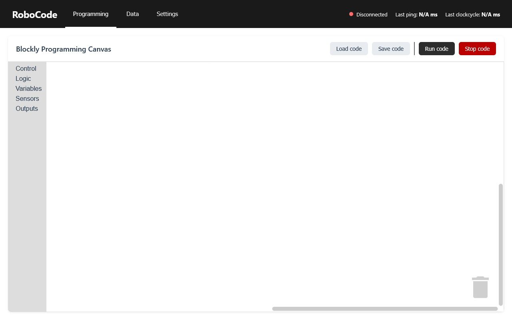

### Connecting the Hexabot to WiFi

In order to control the Hexabot wirelessly, it needs to connect to the users' WiFi network. There is a interface on the Hexabot to configure the WiFi credentials needed to connect to the network. Prepare the following to connect to the WiFi network:

- Complete all previous steps (Installing the motors and robot arm, Installing the electronics components, Installing the battery and Installing programming interface)
- Your WiFi details; network name (SSID) and password
- A Smartphone that can connect to WiFi networks

> [!NOTE]
> The WiFi network to connect to needs to be 2.4GHz, since the Raspberry Pi Pico 2W wireless chip does not support 5GHz networks.

Turn on the Hexabot by toggeling the Power Switch to the **I / On position**. Several lights on the robot should turn on, and after some time, the OLED screen should light up. If the display reads "Connect to AP, SSID:HexaConfig, PASS:xxxxxxxx", the setup can start.

On the smartphone, open the settings and connect to the newly created WiFi network called "HexaConfig" with the password that is shown after "PASS" on the OLED screen of the Hexabot. After a connection is established, open the internet browser on the smartphone and go to the address "`192.168.4.1`". The Hexabot WiFi configuration screen as pictured below will open. Enter the details for the WiFi network in the corresponding fields and click on "Connect to WiFi". The Hexabot will now restart and attempt to connect to the specified WiFi network using the provided password. Once the WiFi details are securely saved, the Hexabot will connect to the network automatically in the future.

    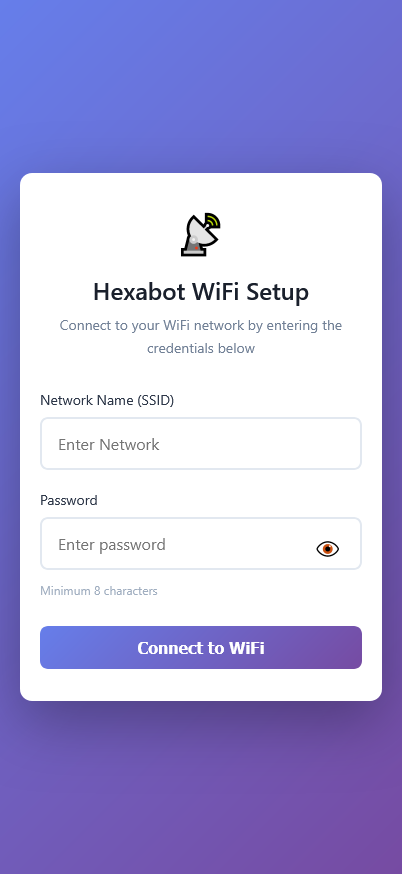

After turning on, if the Hexabot is succesfully connected to WiFi, the robot address on the network will be shown on the screen. An example of this can be seen in the image below.

    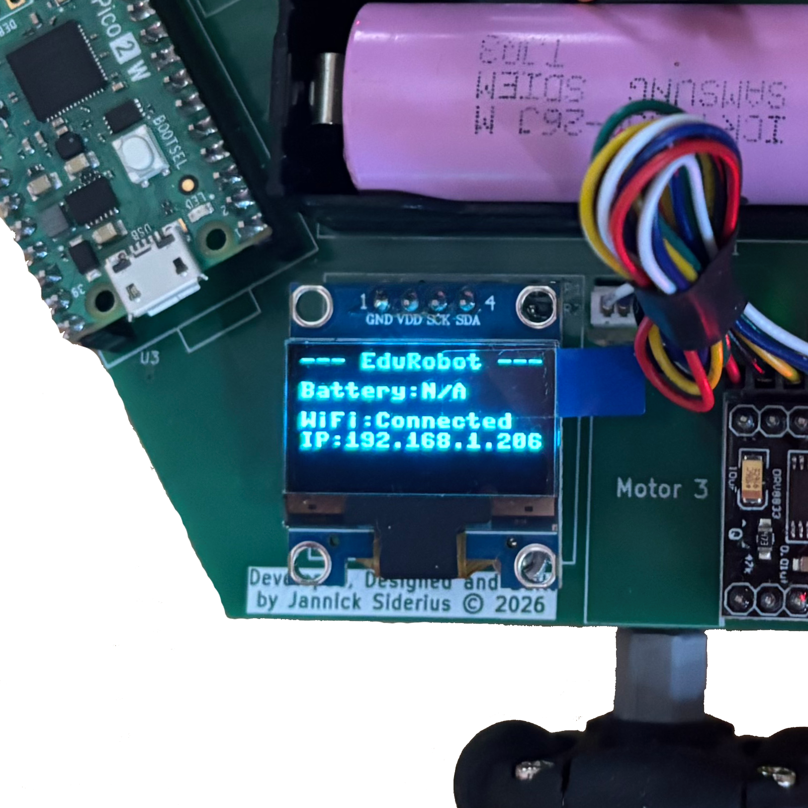

The IP address that is shown on the Hexabot OLED screen is the robot address. This address can be saved into the Programming interface that was configured in the previous section. In the "Robot Settings" tab (reachable by clicking "Settings" in the top menu), the robot address can be input into the Programming interface. After saving the address by clicking "Save Settings", the Programming interface will automatically try to re-connect to the Hexabot robot in the future. The status of the connection can always be seen in the top menu of the Programming interface.

    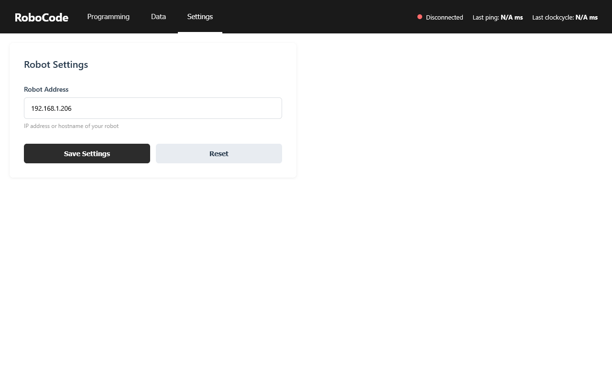

[🔼 Back to the top](#hexabot)

## Programming the Hexabot

The programming interface for the Hexabot features three distinct screens:
- The Programming application
- The Data overview
- The Settings page

The programming application will be discussed in a later section. The data overview page contains all sensordata that is incoming from the Hexabot robot. This data is shown in a table to ensure easy access to all current sensor values. The table is updated frequently in order to reflect the newest data that has been transmitted by the Hexabot. The settings page was introduced in the [Connecting the Hexabot to WiFi](#connecting-the-hexabot-to-wifi) section above. Here, the robot address of the Hexabot can be registered so that the application can connect to the robot.

All screens feature the same top menu which contains links to the respective screens as well as connection information. This shows if a Hexabot robot is connected, when the last message was received and how long the program execution takes.

    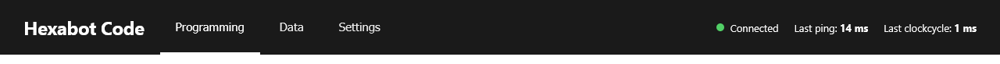

The programming application features a central canvas on which the robot can be programmed. The Hexabot is not programmed with traditional code, but rather by building programs using predefined code-blocks. These blocks enable puzzle-like, intuitive programming without the need to learn complicated syntax or programming interfaces. The code-blocks are available in the "toolbox" that is on the left of the screen. To start the program, click the "Run Code" button in the interface. A simple example of the block-programming can be seen in the image below. If the example program is run on the Hexabot, the left LED will light up in red (a hue setting of 0 equals a bright red color).

    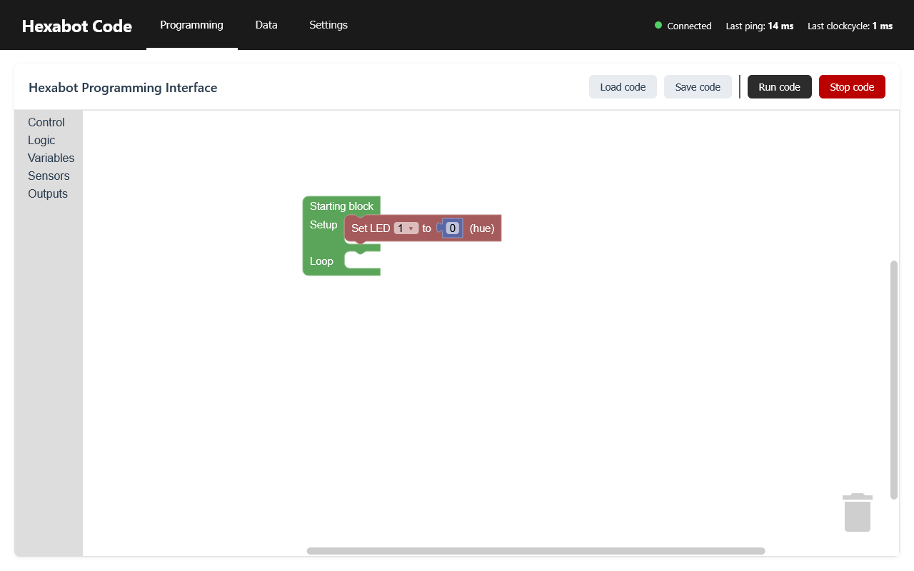

There are different categories of code-blocks:
- Control: Manage program flow with loops
- Logic: Make decisions and comparisons using conditional statements and logical operators
- Variables: Create custom variables and set values like numbers, text and booleans
- Sensors: Get and use the various sensor readings from the robot
- Outputs: Give the various actuators and LEDs on the robot commands

By combining these code-blocks, programs of different complexity can be made.

    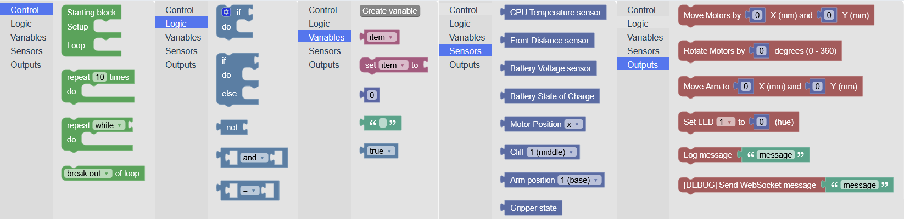

### Example programs

> [!NOTE]
> Example programs will be added in the near future

### Blocks explained

Different types of blocks are available in the Programming interface:

- [Control blocks](#control-blocks)
- [Logic blocks](#logic-blocks)
- [Variable blocks](#variable-blocks)
- [Sensor blocks](#sensor-blocks)
- [Output blocks](#output-blocks)

#### Control blocks

    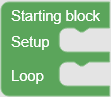
    The Starting block provides a staring point to most robot programs. The block contains two containers. The Setup sub-block runs once at the start of the program, for example to configure variables or robot settings. The Loop sub-block runs continuously and infinitely after Setup is finished. This is used for tasks that should run all the time, for example obstacle avoidance or robot arm positioning. The Loop can be stopped by clicking the "Stop Code" button in the programming interface.

    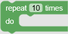
    The Repeat n times block creates a defined loop that executes the blocks inside of the container n times. For example, if the block is set to Repeat 4 times, the blocks inside will execute exactly four times before continuing to blocks below the Repeat n times block.

    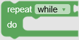
    The Repeat while block creates a repeat loop that runs the blocks inside the container until the loop ends—either when the provided condition becomes false or when the loop is terminated using a Break out of loop block. If you use this block incorrectly (for example, by providing a condition that never becomes false and not including any break/stop mechanism), your program can become stuck in an infinite loop.
     
    This block has an alternative mode called Repeat until, which works similar to the Repeat while but it runs the blocks inside the container until the provided condition becomes true or when the loop is terminated using a Break out of loop block.

    
    The Break out of loop block works together with the Repeat while block. If the block is triggered, any running Repeat while or Repeat until loop will terminate and continue with the block after it.
     
    This block has an alternative mode called Continue next iteration of loop, which skips all blocks underneath this one and continues with the loop of a Repeat while or Repeat until block from the start. It does not terminate the loop, but rather terminate the current loop cycle.

#### Logic blocks

    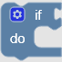
    The If block provides a way to check conditional statements and execute blocks inside the container if the statement evaluates to true or 1. This block is often used in combination with the Logical Operation or Logical Comparison blocks. The gear-icon (settings) enables the addition of (multiple) else statements that extend the block. For more information, look at the If Else block below.

    
    The If Else block is similar to the If block, since it can check conditional statements and execute blocks inside the first container. Alternatively, if the statement evaluates as false or 0, the blocks inside of the second container are executed.

    
    The Not block can be used to invert a conditional statement. If the statement normally evaluates to true or 1 value, the Not block can negate this and turn it into false or 0. Vice versa, if the statement normally evaluates to false or 0, the block negates this into true or 1.

    
    The Logical Operation block can be used to combine statements and conditions. The block can be used in the AND mode, needing two true statements to evaluate to true (the logic table for AND can be found on <a href="https://en.wikipedia.org/wiki/AND_gate" target="_blank">Wikipedia - AND logic gate</a> (links to an external site)).
     
    Alternatively, this block can function in the OR mode, where either of the two statements need to be true in order to evaluate to true (the logic table for OR can be found on <a href="https://en.wikipedia.org/wiki/OR_gate" target="_blank">Wikipedia - OR logic gate</a> (links to an external site)).

    
    The Logical Comparison block can be used compare values using different operators. There are different logic operators included:
<ul>
  <li>Equals (=)</li>
  <li>Does not equal (≠)</li>
  <li>Less than (<)</li>
  <li>Less than or equal to (≤)</li>
  <li>Greater than (>)</li>
  <li>Greater than or equal to (≥)</li>
</ul> 
<!-- Links to extra info:
https://en.wikipedia.org/wiki/Equals_sign
https://en.wikipedia.org/wiki/Equals_sign#Not_equal
https://en.wikipedia.org/wiki/Less-than_sign
https://en.wikipedia.org/wiki/Less-than_sign#Less-than_sign_with_equals_sign
https://en.wikipedia.org/wiki/Greater-than_sign
https://en.wikipedia.org/wiki/Greater-than_sign#Greater-than_sign_with_equals_sign -->

#### Variable blocks

    
    The Create Variable button can be used to create a new named variable. Multiple different variables can be made and used throughout the program using the Get Variable and Set Variable blocks below. Variables can be used to transport and reuse information between different parts of the program.

    
    The Get Variable block allows the reading of variables created with the Create Variable button above. It can be used to connect variables into other blocks, like the If block, or output blocks like Move Motors.

    
    The Set Variable block allows the changing of variables created with the Create Variable button above. Variables can be set to different variable types (Number, Text and Boolean) and can be re-used and changed over time.

    
    The Number Variable block provides a way to input numbers into the program. The number can be assigned to a variable, directly input into conditional statements or output blocks.

    
    The Text Variable block provides a way to input text into the program. The text can be assigned to a variable, directly input into conditional statements or output blocks.

    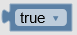
    The Boolean Variable block provides a way to input boolean (true or false) into the program. The boolean can be assigned to a variable, directly input into conditional statements or output blocks.

#### Sensor blocks

    
    The CPU Temperature sensor block can be used to read out the CPU temperature sensor reading from the Hexabot. The data will be derived from the latest CPU temperature that is received by the programming interface.

    
    The Front Distance sensor block can be used to read out the Front Distance sensor reading from the Hexabot. The data will be derived from the latest Front Distance that is received by the programming interface.

    
    The Battery Voltage sensor block can be used to read out the Battery Voltage sensor reading from the Hexabot. The data will be derived from the latest Battery Voltage that is received by the programming interface.

    
    The Battery State of Charge block can be used to read out the Battery State of Charge sensor reading from the Hexabot. The data will be derived from the latest Battery State of Charge that is received by the programming interface.

    
    The Motor Position block can be used to read out the Motor Position sensor reading from the Hexabot. This block can either read out the X or the Y value of the position. The data will be derived from the latest Motor Position that is received by the programming interface.

    
    The Cliff block can be used to read out the Cliff sensor reading from the Hexabot. This block can read out the value of the different cliff sensors: 1 (middle), 2 (left) or 3 (right). The data will be derived from the latest Cliff that is received by the programming interface.

    
    The Arm position block can be used to read out the Arm position reading from the Hexabot. This block can read out the value of the different arm sensors: 1 (base) / 2 (joint). The data will be derived from the latest Arm position that is received by the programming interface.

    
    The Gripper state block can be used to read out the Gripper state from the Hexabot. The data will be derived from the latest Gripper state that is received by the programming interface.

#### Output blocks

    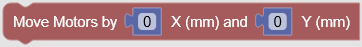
    The Move motors block sends the Hexabot robot a command to move the motors by a specified distance in X and Y. The unit of distance is millimeters (mm). The movement is calculated from the center of the Hexabot robot, with a cartesian coordinate system (positive x to the right, positive y to the top). See the image below for a reference in relation to the robot.

    
    The Rotate motors block sends the Hexabot robot a command to rotate the motors by a specified angle. The unit of the angle is degrees (0 - 360). The rotation is calculated from the center of the Hexabot robot. See the image below for a reference in relation to the robot.

    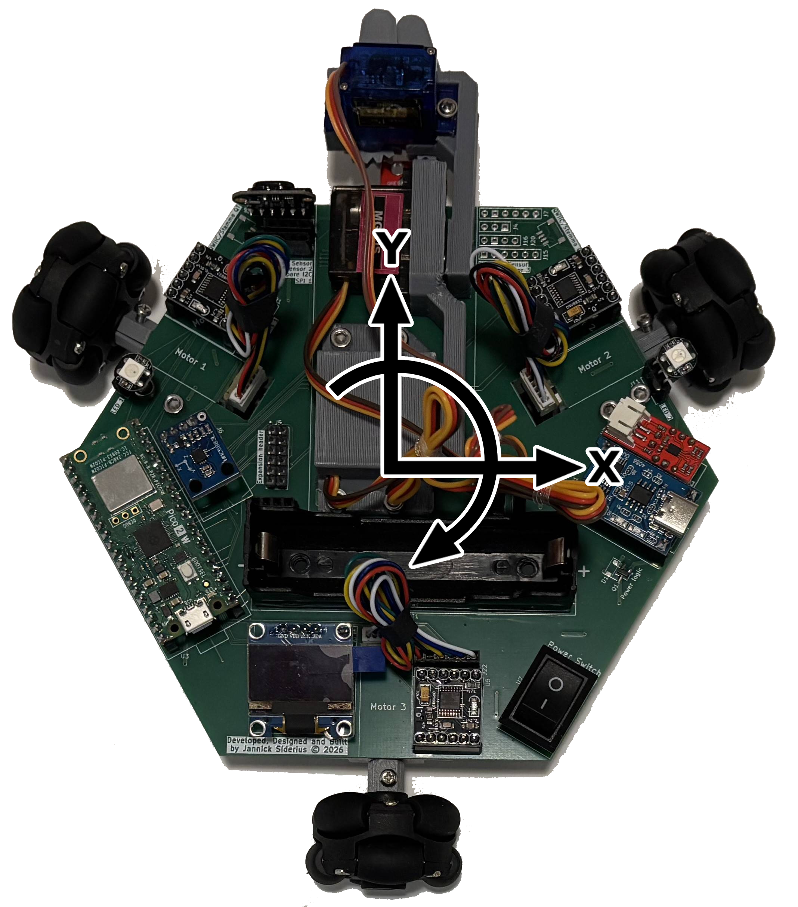

    
    The Move arm block sends the Hexabot robot a command to move the robot arm to a specified set of coordinates X and Y. The unit of these coordinates is millimeters (mm). The movement is calculated from the center axis of the base of the robot arm of the Hexabot robot. The first arm is 45mm, with the second arm is 38mm for a total reach of 83mm. See the image below for a reference in relation to the robot, the grid is a side view, with the base being in the middle of the robot, and the end pointing towards the top of the Hexabot robot.

    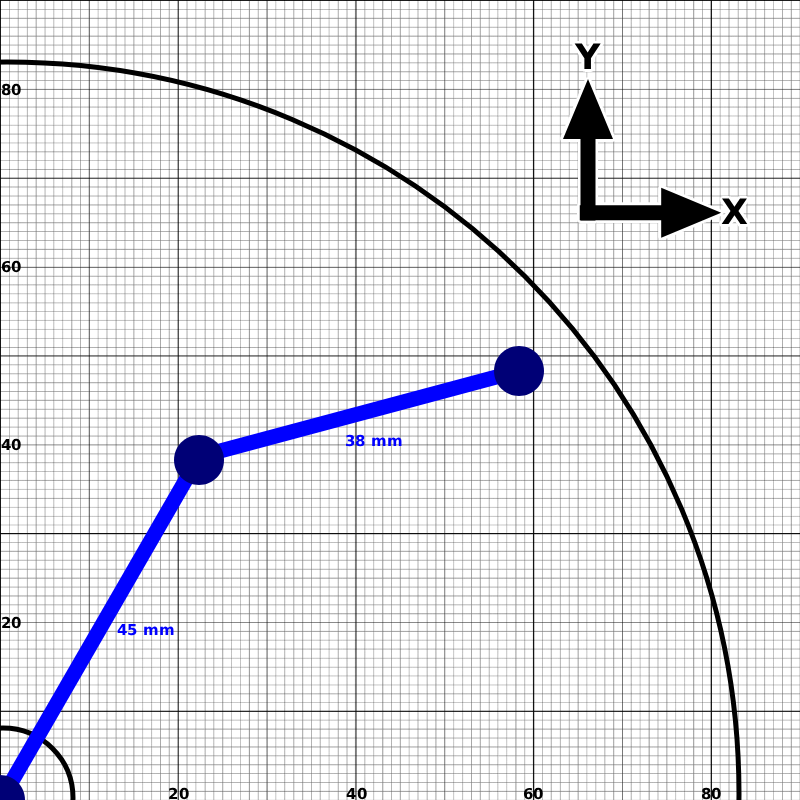

    
    The Set LED 1 / 2 to n (hue) block sends the Hexabot robot a command to set the specified LED to the specified hue color. The value of the LED can be LED 1 (left) or LED 2 (right), the hue is specified acording to the default hue color scale. See the image below for the hue scale.

    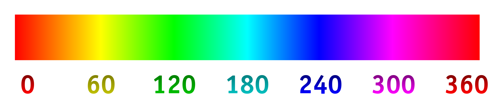

    
    The Log message block is primarily used to solve problems in the code, as the log message can give information about the progress of the program. To read the log messages, open the browser console. For more information about the console, take a look at documentation on <a href="https://www.browserstack.com/guide/browser-console#how-to-open-browser-console" target="_blank">Browserstack - Console</a> (links to an external site).

    
    The [DEBUG] Send WebSocket message block is a debugging block used to send specific commands to the Hexabot robot. It should not be used during normal programming.

<!-- 

    
    The ... block

 -->

[🔼 Back to the top](#hexabot)

## Frequent problems

> [!NOTE]
> Frequent problems will be added in the near future

<!-- - Power and Charging
- WiFi
- Plugging components + cables
- RPi test (data ingest + led output) -->

[🔼 Back to the top](#hexabot)

## Component documentation

> [!NOTE]
> Component documentation will be added in the near future

<!-- - PCB doc + schematic and files
- Pinout doc
- Sensor doc + datasheet
- Motor and wheel doc + datasheet
- Firmware doc? -->

[🔼 Back to the top](#hexabot)

## License

All contents in this repository are *CC BY-SA 4.0* as detailed in the [License](https://github.com/j-siderius/EduRobotApp/blob/main/CC_BY-SA_4.0.license) and in the original license text on the [Creative Commons website](https://creativecommons.org/licenses/by-sa/4.0/).

[🔼 Back to the top](#hexabot)
